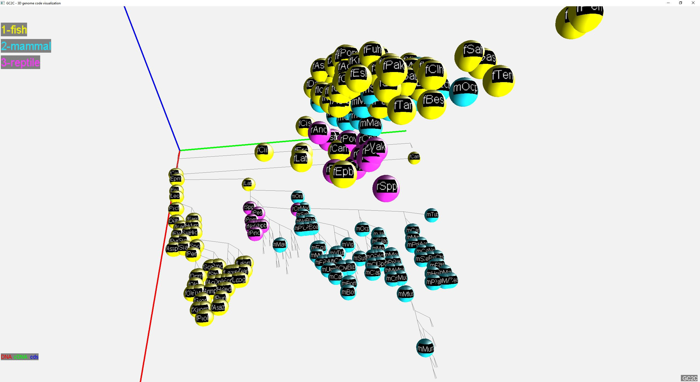
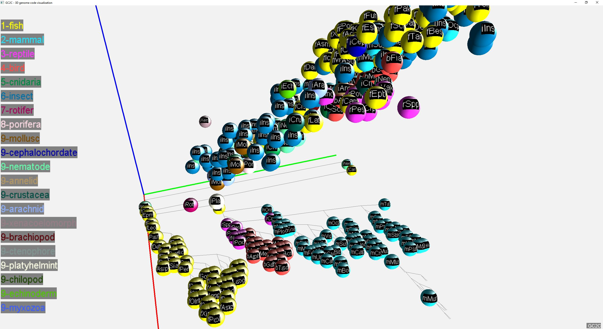
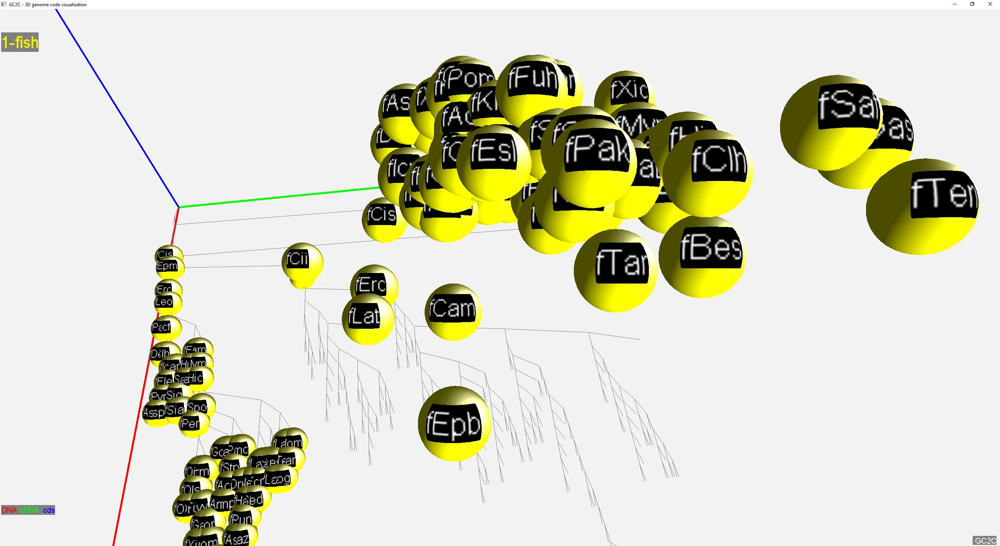

# genomeVis project
# Application GC2C - Genome code 3D visualization

The GC2C application is implemented in the Java programming language and the OpenGL graphics library (lwjgl). The GC2C visualizes individual species rendered as a small sphere and placed in 3D space. The position of the 3D sphere is based on a vector composed of DNA, cDNA and, cds values. These values are normalized and converted to the interval from 0 to 1 in a unit cube with red-green-blue axes.

## Dependencies
* JDK/JRE 1.7
* lwjgl3

## UX
Interaction in 3D space
* Left Mouse Button - camera view direction setting
* W/S - forward and backward camera moving
* A/D - left and right camera moving
* Ctrl/Shift - down and up camera moving
* Space - 1st or 3rd person camera mode setting
* R/F - near or far from center in 3rd person camera mode, only for perspective projection

* X - camera reset
* P - perspective or orthogonal projection
* H - show help
* BackSpace - color mode

* Right Mouse Button - select species, information shown in bottom row, selected species is flashing

Visualization modes
* in 3D cube
* in planar tree chard
* arrows <-  ->  - line interpolation between the positions in both modes
* arrows up/down - size of spheres

Data analyze mode - making eser defined groups, groups colored and connected by lines with center of the group
* T  - change modes
  * nothing - no groups
  * threshold - according to the distance from the root of the tree
  * categories - according  to the level of the depth of the tree
  * PageDown/Up - set the distance or level
* Insert/Delete - change color of the selected groups

## Samples

